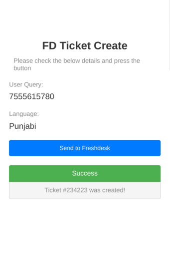

# Description
A special SurveyCTO plugin designed for teletrainers. Now, they can easily make Freshdesk tickets for patient questions right within SurveyCTO. No extra steps of opening Freshdesk separately needed.

[Freshdesk](https://www.freshworks.com/freshdesk/) is a powerful and intuitive cloud-based ticketing system that enables companies to streamline customer support, automate workflows, and deliver personalized service through a unified platform

## Required parameters

| Key                   | Value                                                                                                                                                                                                 |
| --------------------- | ----------------------------------------------------------------------------------------------------------------------------------------------------------------------------------------------------- |
| `patientName`         | This is the name of the patient who has raised a query with the teletrainer                                                                                                                           |
| `phoneNumber`         | This is the phone number of the user who has raised a query                                                                                                                                           |
| `patientQuery`        | This is query raised by the user which needs to be escalated to doctors for resolution                                                                                                                |
| `agentEmail`          | This is the email address of the Teletrainer who used the SurveyCTO plugin to raise the query on Freshdesk. It should match the email address they used to sign up for an agent account on Freshdesk. |
| `projectId`           | This will be the project name attribute on the Freshdesk Ticket                                                                                                                                       |
| `familyConnectedOnWa` | This will be a Yes/No question used to inform the medical executive whether the user wants the answer to their query on WhatsApp or not.                                                              |
| `language`            | This specifies the language preference of the user, this will be used to send the answer back on Whatsapp.                                                                                            |
| `apiToken`            | This is the authentication token required by the API endpoint.                                                                                                                                        |
| `apiUrl`              | This is the URL of the API endpoint that will be invoked to create a ticket on Freshdesk.                                                                                                             |
| `fdUrl`               | This is the URL of our Freshdesk workspace, which will be used to populate this field with a link to the ticket on Freshdesk.                                                                         |
| `callName`            | This will contain the name of the form used to create the ticket on Freshdesk, providing context about the query for the Freshdesk ticket.                                                            |
